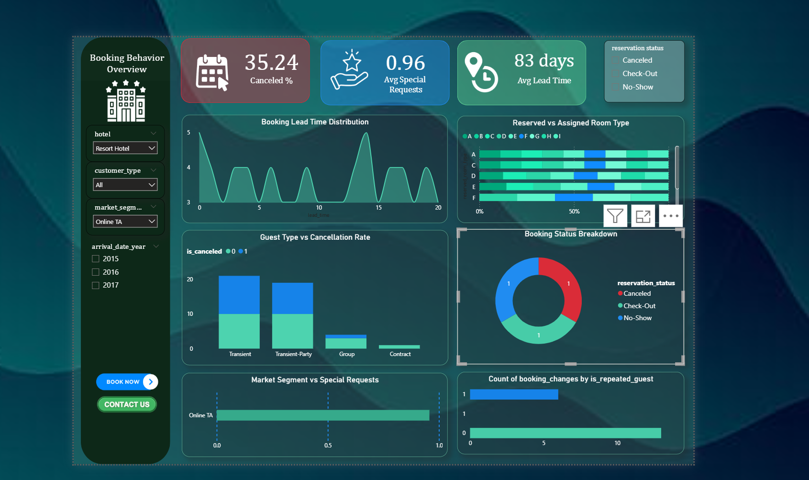

# Hotel Booking Analysis | Python & Power BI

This project was created as part of my journey in the **Advanced Data Analysis track** during the **NTI Internship**, under the guidance of **Instructor Donia**. The objective was to explore hotel booking behaviors, uncover trends in cancellations, and deliver actionable insights through data visualization.

---

## ✦ Project Summary

The dataset contains over **119,000 hotel booking records**, capturing guest details, reservation patterns, and cancellation behavior.  
My goal was to clean the data, explore it deeply using EDA, and finally present the key findings in a clear and interactive Power BI dashboard.

---

## ✦ Tools & Libraries Used

**🔹 Python**  
- `pandas`, `numpy` → data manipulation  
- `seaborn`, `matplotlib` → data visualization  
- `scipy.stats` → outlier detection  
- `sklearn.preprocessing.StandardScaler` → scaling numeric features

**🔹 Power BI**  
- Cards, donut charts, bar charts, and slicers for interactivity  
- DAX measures for KPIs (e.g., cancellation rate, average lead time)

---

## ✦ Project Workflow

**1. Data Cleaning**
- Filled missing values based on data context
- Detected and handled outliers using Z-scores
- Applied feature scaling where appropriate  
- Final dataset was fully cleaned and consistent

**2. Exploratory Data Analysis (EDA)**
- Analyzed booking lead times, customer types, reservation statuses
- Compared cancellation rates across different segments
- Explored mismatches between reserved and assigned rooms

**3. Dashboard Development (Power BI)**
- Built an interactive dashboard with filters for hotel type, year, customer type, and market segment  
- Included KPI cards, bar charts, pie chart, and distribution visuals  
- Designed with simplicity and insight delivery in mind

---

## ✦ Key Insights

- ❖ **37% of bookings were canceled**, with Transient and Transient-Party guests driving most of it  
- ❖ Guests booked **an average of 104 days in advance**
- ❖ The **average number of special requests was low (0.57)**  
- ❖ There's a noticeable **gap between reserved and assigned room types** in some bookings  
- ❖ Group and contract guests had **lower cancellation rates** compared to others  
- ❖ Certain market segments like Online TA had higher booking activity and request patterns  

---

## ✦ Dashboard Preview
📍 *Snapshot of the interactive dashboard built in Power BI:*

---

## ✦ Project Files

| File                         | Description                                      |
|-----------------------------|--------------------------------------------------|
| `hotel_booking_cleaning.ipynb` | Data cleaning and EDA notebook (Python)         |
| `cleaned_hotel_booking.csv` | Final cleaned dataset used in Power BI          |
| `dashboard_screenshot.png`  | Static image of the Power BI dashboard          |
| `R
